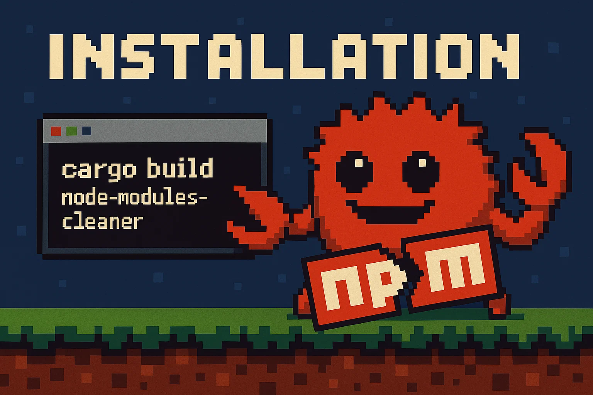

# node-cleaner

[](https://opensource.org/licenses/MIT)
[](https://github.com/Breinss/rust-node-modules-cleaner)
[](https://github.com/Breinss/rust-node-modules-cleaner/releases/tag/v0.2.0)
> ⚠️ **Work in Progress** - Not yet available via package managers

A lightning-fast CLI tool written in Rust that scans your system for `node_modules` directories and helps you safely clean them up to reclaim disk space.

## Overview

JavaScript and Node.js projects are notorious for creating massive `node_modules` directories that:

- Consume gigabytes of disk space
- Slow down backups and file indexing
- Create redundant copies across projects
- Include unnecessary files for production use

`node-cleaner` is designed to help you identify and safely remove unnecessary files from these directories, reclaiming valuable disk space without breaking your projects.

## Description

`node-modules-scanner` is a high-performance Rust CLI tool that recursively scans your filesystem for `node_modules` directories and reports on them based on configurable pattern matching rules. It helps you identify:

- Redundant or abandoned `node_modules` directories -- Still unsure on this feature since it will require a greater itteration load, might add it as a possible flag 
- Which patterns inside `node_modules` are safe to remove
- Files categorized by safety level (safe, caution, danger)
- Total space occupied by different types of files

## Features

- **Blazing fast scanning** powered by Rust's `walkdir` crate
- **Configurable pattern matching** via JSON configuration
- **System-wide scanning** with intelligent path exclusions
- **Categorized reporting** of files by safety level
- **Size reporting** to identify the largest space consumers
- **Minimal dependencies** for a lightweight installation




## Installation

### From Source (Current Method)

```bash
# Clone the repository
git clone https://github.com/Breinss/rust-node-modules-cleaner.git

# Navigate to the project directory
cd rust-node-modules-cleaner

# Build the project
cargo build --release

# Optional: Install to your system
sudo cp target/release/node-cleaner /usr/local/bin/
```

### Arch Linux

```bash
yay -S node-cleaner
```

## Usage

### Basic Commands

```bash
# Run a basic scan in the current directory and subdirectories
node-cleaner

# Run with debug output
node-cleaner --debug true

# Enable verbose logging (multiple levels available)
node-cleaner -v     # Verbose output
node-cleaner -vv    # More detailed output
node-cleaner -vvv   # Debug-level output

# Run a full scan (includes more thorough analysis)
node-cleaner --full
```

### Example Output

```
✅ Successfully loaded patterns config
📂 Scanning directories...
🔍 Found 42 node_modules directories
💡 Identified 156 files safe to remove (3.2 GB potential savings)
⚠️ Found 23 files requiring caution (0.8 GB)
❌ Found 5 potentially unsafe files (0.1 GB)

Files to clean:
  1. /home/user/projects/webapp/node_modules/package/tests (45.2 MB)
  2. /home/user/projects/api/node_modules/module/examples (230.5 MB)
  ...

Would you like to remove these files? [Y/n]
```

## Configuration

The tool uses a pattern-matching system to identify which files are safe to remove. These patterns are defined in a JSON configuration file.

### Pattern Categories

- **Safe**: Files that are generally safe to remove (documentation, tests, examples)
- **Caution**: Files that might be needed in some cases (images, CSS, HTML)
- **Danger**: Files that are likely needed for the package to function (source code, compiled assets)

### Configuration Format

```json
{
    "$default": "safe",
    
    "safe": {
        "patterns": [
            "readme*",
            ".npmignore",
            "license",
            "*.md",
            "examples/",
            "tests/"
        ],
        "ignore": [
            "validate-npm-package-license",
            "spdx-license-ids"
        ]
    },
    
    "caution": {
        "patterns": [
            "*.png",
            "*.jpg",
            "*.html",
            "*.css"
        ],
        "ignore": []
    },
    
    "danger": {
        "patterns": [
            "*.js",
            "*.ts",
            ".bin/",
            "dist/"
        ],
        "ignore": []
    }
}
```

## Troubleshooting

### Common Issues

**Permission Denied Errors**
- Ensure you have read access to all directories being scanned
- For system-wide cleaning, you may need to run with sudo

**No Files Found**
- Check that you're running the command in a directory containing Node.js projects
- Try using the `--full` flag for a more thorough scan

**Program Crashes During Scan**
- This may occur when scanning very large directory structures
- Try running with less verbose output (remove `-v` flags)

### Getting Help

If you encounter issues not covered here, please:
1. Run with `-vvv` to get debug output
2. File an issue on GitHub with the full error message and debug output


## Roadmap

- [x] Improve scanning algorithm efficiency  
  *23-05-2025: Improved by factor of two from original algorithm*
- [ ] Add size-based reporting and filtering
- [ ] Implement interactive mode for selective cleaning
- [x] Add package manager integration (AUR, apt, etc.)
*27-05-2025: Added YAY AUR install*
- [ ] Create configuration file generator
- [ ] Add export options (JSON, CSV)
- [x] Implement multithread scanning for improved performance  
  *23-05-2025: Implemented using Rayon and jWalk for multithreaded operation*
- [ ] Add visualization of space usage

## System Requirements

- Linux-based operating system (tested on Ubuntu, Arch)
- May work on macOS (untested)
- Not compatible with Windows


## For Developers

### Project Structure

```
rust-node-modules-cleaner/
├── src/
│   ├── main.rs                # Entry point and main logic
│   ├── config/                # Configuration handling
│   │   ├── mod.rs
│   │   ├── cli.rs             # Command-line interface
│   │   ├── config.rs          # Configuration loading
│   │   └── patterns.json      # Default patterns
│   ├── file_utils/            # File system operations
│   │   ├── mod.rs
│   │   ├── fs_utils.rs        # File system utilities
│   │   ├── matcher.rs         # Pattern matching
│   │   └── remover.rs         # File removal
│   └── utils/                 # General utilities
│       ├── mod.rs
│       ├── g_utils.rs         # UI helpers
│       └── read_size.rs       # Size calculation
├── Cargo.toml                 # Dependencies
├── PKGBUILD                   # Arch packaging
└── README.md                  # This file
```

### Building for Different Platforms

```bash
# Build for current platform
cargo build --release

# Cross-compile (requires appropriate rust targets)
rustup target add x86_64-unknown-linux-gnu
cargo build --release --target=x86_64-unknown-linux-gnu
```

### Running Tests

```bash
cargo test
```

## License

This project is licensed under the MIT License - see the [LICENSE](LICENSE) file for details.

## Contributing

Contributions are welcome! Please feel free to submit a Pull Request.

1. Fork the repository
2. Create your feature branch (`git checkout -b feature/amazing-feature`)
3. Commit your changes (`git commit -m 'Add some amazing feature'`)
4. Push to the branch (`git push origin feature/amazing-feature`)
5. Open a Pull Request

## Disclaimer

**USE AT YOUR OWN RISK**: This tool modifies your file system by deleting files and directories. While it's designed to be safe, I am not responsible for any data loss or damage that may occur from using this software.

- Always review the files marked for deletion before confirming
- Consider backing up important projects before running this tool
- Test on non-critical directories first
- No warranty is provided, express or implied
- By using this tool, you acknowledge and accept these risks

Remember that node_modules can sometimes contain modified files or custom patches that might be critical to your project.
