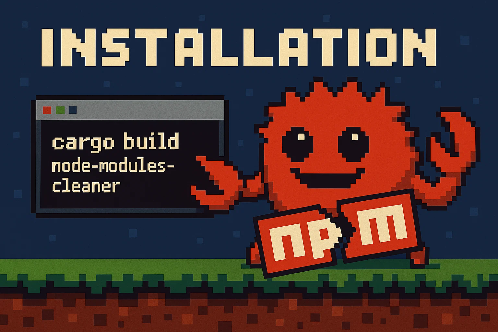

# node-modules-scanner

[](https://opensource.org/licenses/MIT)
[](https://github.com/Breinss/rust-node-modules-cleaner)


> ⚠️ **Work in Progress** - Not yet available via package managers

A lightning-fast CLI tool that scans and identifies unnecessary or oversized `node_modules` directories across your system.

## Why

JavaScript projects are notorious for creating massive `node_modules` directories that:

- Consume gigabytes of disk space
- Slow down backups and file indexing
- Create redundant copies across projects
- Include unnecessary files for production

Existing tools either lack speed, configurability, or system-wide scanning capabilities. This project aims to solve these issues with a fast Rust implementation that can be distributed via Linux package managers for easy installation and updates.

## Description

`node-modules-scanner` is a high-performance Rust CLI tool that recursively scans your filesystem for `node_modules` directories and reports on them based on configurable pattern matching rules. It helps you identify:

- Redundant or abandoned `node_modules` directories -- Still unsure on this feature since it will require a greater itteration load, might add it as a possible flag 
- Which patterns inside `node_modules` are safe to remove
- Files categorized by safety level (safe, caution, danger)
- Total space occupied by different types of files

## Features

- **Blazing fast scanning** powered by Rust's `walkdir` crate
- **Configurable pattern matching** via JSON configuration
- **System-wide scanning** with intelligent path exclusions
- **Categorized reporting** of files by safety level
- **Size reporting** to identify the largest space consumers
- **Minimal dependencies** for a lightweight installation




## Installation

> ⚠️ Not yet available via package managers

For now, you can build and install manually:

```bash
# Clone the repository
git clone https://github.com/Breinss/rust-node-modules-cleaner.git

# Navigate to the project directory
cd rust-node-modules-cleaner

# Build the project
cargo build --release

# Optional: Install to your system (requires appropriate permissions)
# sudo cp target/release/node-cleaner /usr/local/bin/
```

## Usage

Basic usage:

```bash
# Scan system-wide with default settings
node-cleaner

# Specify verbosity level
node-cleaner -v     # Verbose output
node-cleaner -vv    # Very verbose output
node-cleaner -vvv   # Debug output

# Scan with custom arguments
node-cleaner --arguments "custom_arg"
```

Output example:

```
[INFO] Successfully loaded patterns config
[INFO] Total amount of directories found: 42
[INFO] Found 156 files which match the `safe` pattern
```

## Configuration

The tool uses a JSON configuration file to define pattern matching rules. Each rule set contains patterns to match and items to ignore.
This JSON is included into the binary when built, if you'd like to adjust the JSON you would need to edit it before using:

```bash
cargo build --release
```
Example:

```json
{
    "$default": "safe",
    
    "safe": {
        "patterns": [
            "readme*",
            ".npmignore",
            "license",
            "*.md",
            "*.markdown",
            ".gitignore",
            "examples",
            "tests"
            // ... other safe patterns
        ],
        "ignore": [
            "validate-npm-package-license",
            "spdx-license-ids"
        ]
    },
    
    "caution": {
        "patterns": [
            "*.png",
            "*.jpg",
            "*.html",
            "*.css"
            // ... other files to use with caution
        ],
        "ignore": []
    },
    
    "danger": {
        "patterns": [
            "*.coffee",
            "*.ts",
            ".bin",
            "*.min.js"
            // ... other potentially risky patterns
        ],
        "ignore": []
    }
}
```

## Roadmap

- [ ] Improve scanning algorithm efficiency
- [ ] Add size-based reporting and filtering
- [ ] Implement interactive mode for selective cleaning
- [ ] Add package manager integration (AUR, apt, etc.)
- [ ] Create configuration file generator
- [ ] Add export options (JSON, CSV)
- [ ] Implement multithread scanning for improved performance
- [ ] Add visualization of space usage

## Developer Notes

### Project Structure

```
rust-node-modules-cleaner/
├── src/
│   └── main.rs        # Core application logic
├── patterns.json      # Pattern matching configuration
├── Cargo.toml         # Project dependencies
└── README.md          # This file
```

### Building for Different Platforms

To build for various Linux distributions:

```bash
# Build for current platform
cargo build --release

# Cross-compile for different targets (requires appropriate tools)
# rustup target add x86_64-unknown-linux-gnu
# cargo build --release --target=x86_64-unknown-linux-gnu
```

### Contributing

Contributions are welcome! Please feel free to submit a Pull Request.

## License

This project is licensed under the MIT License - see below for details:

```
MIT License

Copyright (c) 2025 Breinss

Permission is hereby granted, free of charge, to any person obtaining a copy
of this software and associated documentation files (the "Software"), to deal
in the Software without restriction, including without limitation the rights
to use, copy, modify, merge, publish, distribute, sublicense, and/or sell
copies of the Software, and to permit persons to whom the Software is
furnished to do so, subject to the following conditions:

The above copyright notice and this permission notice shall be included in all
copies or substantial portions of the Software.

THE SOFTWARE IS PROVIDED "AS IS", WITHOUT WARRANTY OF ANY KIND, EXPRESS OR
IMPLIED, INCLUDING BUT NOT LIMITED TO THE WARRANTIES OF MERCHANTABILITY,
FITNESS FOR A PARTICULAR PURPOSE AND NONINFRINGEMENT. IN NO EVENT SHALL THE
AUTHORS OR COPYRIGHT HOLDERS BE LIABLE FOR ANY CLAIM, DAMAGES OR OTHER
LIABILITY, WHETHER IN AN ACTION OF CONTRACT, TORT OR OTHERWISE, ARISING FROM,
OUT OF OR IN CONNECTION WITH THE SOFTWARE OR THE USE OR OTHER DEALINGS IN THE
SOFTWARE.
```

Only tested with Linux, might work on macOS, most definetly will not work on Windows


